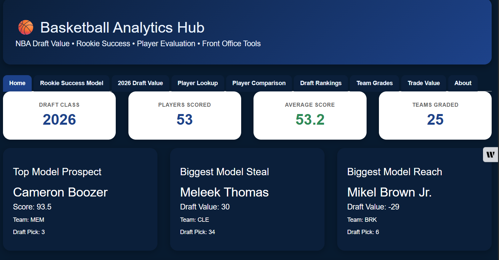
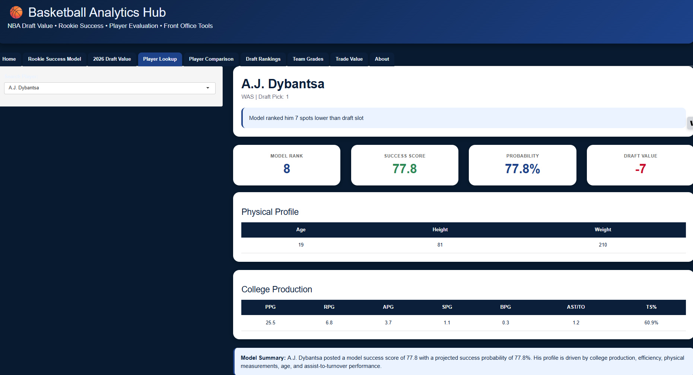
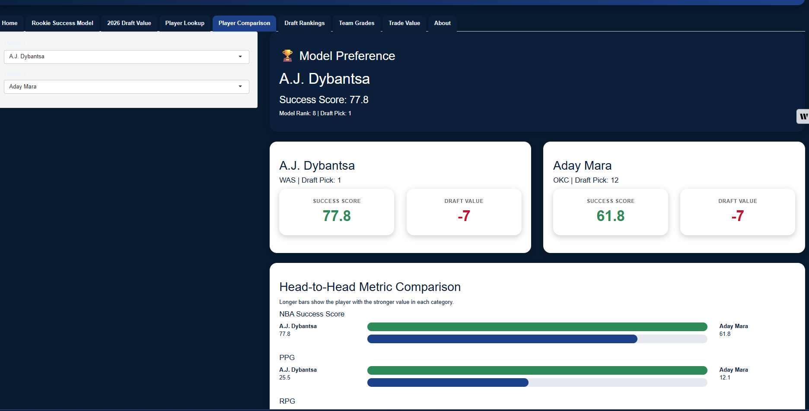
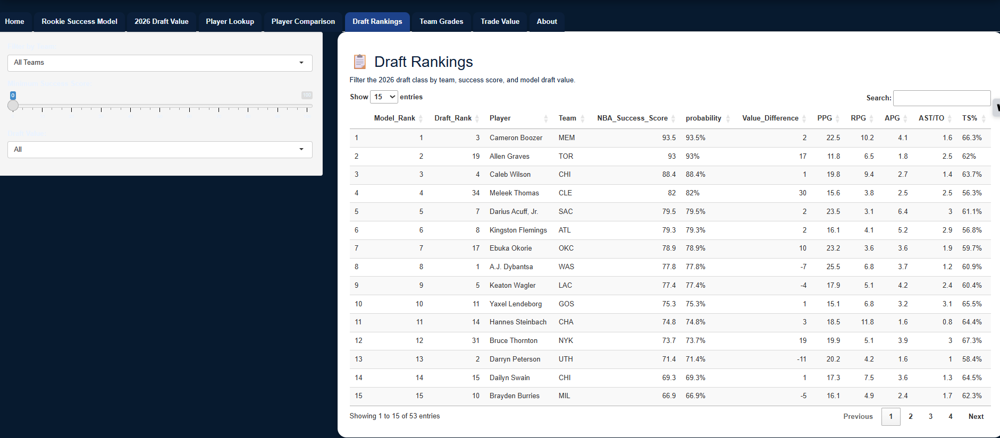
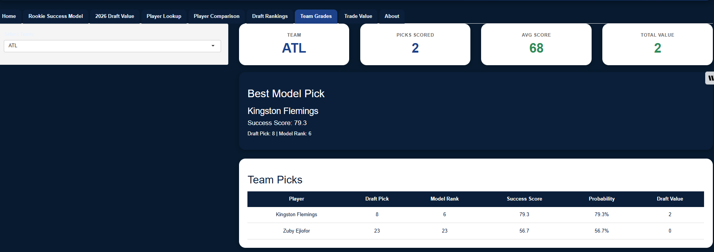

# 🏀 Basketball Analytics Hub

An interactive R Shiny application for NBA Draft evaluation, rookie success prediction, player comparison, and front-office decision support.

## 🚀 Live Demo

👉 https://yfazp7-danny-thompson.shinyapps.io/basketball-analytics-hub/

---

## Dashboard Preview


## 🏠 Home Dashboard



---

## 👤 Player Lookup



---

## ⚖️ Player Comparison



---

## 📋 Draft Rankings



---

## 📊 Team Grades


## Live Application

👉 **Live App:** *(Paste your Shiny URL here)*

---

## Features

### 📈 2026 NBA Draft Value Model
- Model rankings for the 2026 NBA Draft class
- Draft Value metric
- Success Score predictions
- Draft steals and reaches

### 🏀 Rookie Success Model
- Historical NBA rookie success prediction
- Probability of NBA success
- Predictive modeling built in R

### 👤 Player Lookup
- Search any player in the draft class
- View:
  - Success Score
  - Model Rank
  - Draft Value
  - College statistics
  - Physical profile

### ⚖️ Player Comparison
Compare two prospects side-by-side.

Includes:

- Model Preference
- Success Score
- Draft Value
- College production
- Head-to-head visual comparisons

### 📋 Draft Rankings
Interactive rankings with filters for:

- Team
- Success Score
- Draft Value

### 📊 Team Draft Grades
Evaluate each NBA team's draft based on:

- Average Success Score
- Best draft pick
- Total Draft Value
- Team selections

### 🔄 Trade Value (Coming Soon)
Future module for evaluating NBA trade value using production, age, contracts, and team context.

---

# Technologies

- R
- Shiny
- dplyr
- ggplot2
- DT
- readxl

---

# Repository Structure

```
Basketball Analytics Hub/
│
├── app.R
├── global.R
├── server.R
├── ui.R
├── modules/
├── data/
├── www/
└── README.md
```

---

# Related Projects

### 🏀 NBA Rookie Success Model

https://github.com/DannyTData/predicting-nba-career-success

### 📈 2026 NBA Draft Value Model

https://github.com/DannyTData/2026-nba-draft-value-model

---

# Future Improvements

- Player photos
- Trade Value Model
- Salary analysis
- Draft simulator
- Free agency tools
- Team needs dashboard
- Interactive visualizations

---

# Author

**Danny Thompson**

Basketball Analytics | Predictive Modeling | Sports Data Science

Aspiring NBA/WNBA Basketball Operations & Analytics Professional
